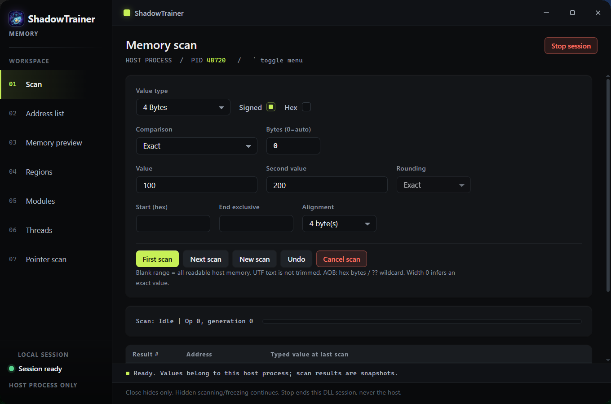

# ShadowTrainer

[English](README.md) | [中文](README_CN.md)

ShadowTrainer 是一款适用于 Windows 的内存扫描器和修改器（Trainer）运行时，以单个 x64 DLL 形式提供。
将其加载到目标进程后，它会打开独立的窗口，用于扫描、修改和冻结该进程的内存。无需驱动、无需服务、无需辅助程序、不会在宿主程序旁写入任何文件，也无需单独选择目标进程 —— 被加载进的进程**本身就是**目标。



界面采用 WebView2 页面实现。它作为资源编译进 DLL 中，并通过虚拟源提供服务，因此绝不会读写磁盘；若系统缺少 WebView2 运行时，UI 会平稳降级提示，而不会中断整个会话。

## 功能特性

**扫描 (Scanning)** —— 包含扫描 (Scan)、地址列表 (Address list)、内存预览 (Memory preview)、内存区域 (Regions)、模块列表 (Modules)、线程列表 (Threads) 以及指针扫描 (Pointer scan) 七个页面。

| 功能分类   | 说明                                                         |
| ---------- | ------------------------------------------------------------ |
| 数值类型   | Byte、2 / 4 / 8 字节（有符号、无符号、十六进制）、Float、Double、UTF-8、UTF-16LE、字节数组 (AOB) |
| 首次扫描   | 精确数值、未知初始值、大于、小于、两者之间                   |
| 再次扫描   | 包含上述选项，外加：变动 / 未变动、增加 / 减少、按指定增量增加 / 减少 |
| 文本与 AOB | 精确匹配以及定长变动 / 未变动；支持 AOB 通配符 `??`、`A?`、`?F` |
| 浮点数     | 精确数值，以及参考实现中的四舍五入 (Rounded)、极限四舍五入 (Rounded (extreme)) 和截断 (Truncated) |
| 扫描结果   | 写入磁盘文件、支持分页浏览、可取消扫描、支持一级撤回 (Undo)；取消扫描绝不会覆盖上一次成功的扫描结果 |

**地址列表 (Address list)** —— 支持添加、编辑和删除条目；可为每个条目设置描述、类型、数值和锁定（冻结）；支持最多 16 层的指针链，每次写入时重新解析，因此冻结值会随基地址指针变化动态跟随。如果某个条目的冻结范围与现有已冻结区间重叠，系统会拒绝该操作而非静默覆盖写入。

**内存预览 (Memory preview)** —— 提供 256 字节的 Hex/ASCII 视图，具备十种显示模式（字节，2、4、8 字节的十六进制与十进制表示，以及 Float 和 Double）。字节可就地编辑：十六进制单元格逐位 (nibble) 输入并显示待提交数字，十进制与浮点数单元格按回车确认、按 Esc 取消，每一次写入操作（包括在网格上拖选的范围填充）都会记录进 256 层的撤销栈中。支持通过“前进 (Forward)”与“后退 (Back)”翻阅访问过的页面。

**指针扫描 (Pointer scan)** —— 从目标地址反向搜索多级指针路径，支持可选的静态模块过滤，生成的记录可直接拖入地址列表中。四大限制（收集槽位、单节点独立偏移数、单层节点数、结果数量）均有明确展示，触发任一上限时会截断结果集并进行提示，绝不隐瞒。

**进程视图 (Process views)** —— 为宿主进程提供“内存区域 (Regions)”、“模块列表 (Modules)”和“线程列表 (Threads)”视图，每次刷新生成一致性快照。全只读模式，受访问掩码限制：线程句柄以 `THREAD_QUERY_LIMITED_INFORMATION` 权限打开，因此本代码无法挂起、恢复或终止线程，亦绝不修改内存保护属性、线程优先级或模块列表。

**作弊表 (Cheat tables)** —— 经典 XML 格式，支持严格的有符号 32 位子集 (v1) 与扩展类型 (v2)。导入来自其他工具的文件时不会丢失本项目无法呈现的数据：未知元素会被原样保留并在保存时写回；无法执行的记录类型（如 Auto Assembler 脚本等）会作为只读的不透明行载入，在导出时能逐字节完整复原。

**快捷键 (Hotkey)** —— 反引号键 ` 用于切换窗口显隐。纯采样检测，不使用全局键盘钩子 (Keyboard Hook)：绝不拦截宿主程序的输入，宿主按键可正常响应。

## 运行与构建需求

- 操作系统：Windows 10 或 11，**仅支持 x64**。
- 构建环境：安装有“使用 C++ 的桌面开发”工作负载的 Visual Studio (VS18 / MSVC) 以及 Windows SDK。`build.cmd` 开头硬编码了 VS 根目录路径；若您的安装路径不同，请修改该行。
- 运行依赖：[Microsoft Edge WebView2 Runtime](https://developer.microsoft.com/microsoft-edge/webview2/)。若未安装，除界面外所有功能仍可工作，界面将降级显示未安装提示卡片。

无其他外部依赖。WebView2 SDK 已放置于 `third_party/webview2/` 目录下，并静态链接了其加载器 —— 当模块注入第三方进程时，无法保证同目录下存在 `WebView2Loader.dll`。若编译引入了该动态库依赖，`build.cmd` 将中断并报错。

## 构建方式

```bat
build.cmd
```

运行后将在 `dist/x64/shadowtrainer.dll` 生成产物。无需安装器，无打包流程。

## 加载运行

任何标准加载机制均可使用 —— `LoadLibraryW`、调试器、注入工具均可（本项目不附带注入器）。DLL 一经加载即会自动创建并显示窗口。

若外部调用程序希望控制该窗口，请持有加载引用并遵循以下顺序：发起停止请求 -> 等待停止完成 -> 释放 DLL。停止操作会卸载该模块，因此后续如需再次使用需重新加载。

| 窗口交互协议 | 说明                                           |
| ------------ | ---------------------------------------------- |
| 窗口属性     | 带有 `SHADOWTRAINER_WINDOW` 属性的独立顶层窗口 |
| `WM_APP+1`   | 显示窗口                                       |
| `WM_APP+2`   | 停止并卸载                                     |
| `WM_APP+3`   | 切换窗口显隐                                   |
| `WM_CLOSE`   | 仅隐藏窗口，不会终止当前会话                   |

隐藏窗口不会中断正在运行的内存扫描或数据冻结。

## API 接口

`include/ce/api.h` 与 `include/ce/api_v2.h` 为纯 C 接口，共导出 47 个函数：
版本 1 包含 17 个导出函数，自冻结后未再改动；版本 2 包含 30 个导出函数，新增了显式结构体版本号、调用方提供缓冲区机制以及扩展类型支持。版本 1 接口将持续保留且不会被隐式截断 —— 若对 v1 接口执行其无法表达的会话操作，调用会被直接拒绝，而非进行取整或降级处理。

所有接口均为同步调用，无回调函数。标准的 v2 接口调用方式为传入缓冲区及其容量，并返回所需大小；因此当传入 `(nullptr, 0)` 时，该函数即可用于查询“需要分配多少内存”。

边界条件、精确比较与取整逻辑、以及各版本的拒绝策略均记录在 [`docs/COMPATIBILITY.md`](docs/COMPATIBILITY.md) 中。

## 代码仓库布局

```
include/ce/    公共 ABI 接口：api.h (v1) 与 api_v2.h (v2)
src/core/      扫描引擎、类型化读写层、指针扫描器
src/ui/        主窗口、WebView2 宿主环境、启动过渡层、快捷键监听
src/bridge/    JS ↔ C++ 命令桥接层及其 JSON 交互
web/           前端页面：index.html, css/, js/, img/
third_party/   WebView2 SDK（头文件、静态加载器、微软许可证协议）
docs/          子系统文档（中英文双语）
```

`src/runtime.cpp` 是根目录唯一的翻译单元；每个模块目录均作为一个包含根路径 (include root)。`web/` 目录下的网页也可以直接通过磁盘打开 —— 资源路径兼作 URL 与文件路径，因此 `web/index.html` 脱离 DLL 也能独立运行，样式和脚本保持完好。

## 界面开发调试

```bat
build\x64\dev_host.exe --dev
```

`dev_host` 会在进程内加载 DLL，并直接从磁盘读取 `web/` 内容而非读取嵌入式资源，因此修改样式表后直接按 F5 刷新即可生效，无需重新编译。详细页面实现、资源流水线、桥接协议与 WebView2 生命周期请参阅 [`docs/WEBUI.md`](docs/WEBUI.md)。

## 项目状态

这是一个范围被严格限定的在研项目，有必要坦率说明其现状：内存扫描、地址列表、数值冻结、十六进制编辑器、指针扫描、进程视图、作弊表导入/导出以及整体用户界面均已实现并经过测试。

以下功能**尚未实现**，且未作任何虚假占位：调试器、反汇编与汇编引擎、Lua 脚本、Auto Assembler 脚本执行、修改器生成目标格式、符号与结构体解析、插件机制、Mono/CLR/Java 支持以及变速齿轮 (speedhack)。驱动程序、DBVM 和远程服务功能明确属于范围之外，且不支持扫描加载该模块之外的其他进程。

[`docs/FEATURE_PARITY.md`](docs/FEATURE_PARITY.md) 逐行详细列出了已完成、部分完成和尚未实现的功能对照。若要了解某项功能是否可用，请在查阅代码前先阅读该对照表。

## 项目文档

| 文档链接                                           | 描述                                         |
| -------------------------------------------------- | -------------------------------------------- |
| [`docs/README.md`](docs/README.md)                 | 文档导航索引                                 |
| [`docs/WEBUI.md`](docs/WEBUI.md)                   | 界面开发：分层架构、资源、启动时序与桥接协议 |
| [`docs/COMPATIBILITY.md`](docs/COMPATIBILITY.md)   | 语义规范、边界限制与 ABI 契约                |
| [`docs/FEATURE_PARITY.md`](docs/FEATURE_PARITY.md) | 功能完整度迁移对照表                         |
| [`docs/PROCESS_VIEWS.md`](docs/PROCESS_VIEWS.md)   | 只读进程视图（内存区域 / 模块 / 线程）       |
| [`docs/STATUS.md`](docs/STATUS.md)                 | 开发状态、迭代记录与证据规范                 |

所有文档均提供简体中文对应的 `_CN` 版本。

## 仓库内容说明

此处发布了构建和运行该运行时所需的一切资源，包括测试源码和开发工具。未提交至版本库的文件均为可重新生成的文件或本地临时文件：构建产物（`build/`、`dist/`）、Visual Studio 状态与 MSVC 中间文件、Agent 临时目录 `.scratch/` 以及 `AGENTS.md`。详见 `.gitignore`。

`baseline/pre-webui/` 归档了被 WebView2 页面替换掉的原生界面旧版 —— 包含其源码、测试代码、探测截图及说明文档。构建流程不会引用该目录，它也不作为回滚分支使用；保留它仅因为当时没有版本控制历史记录可供追溯。

## 第三方组件

`third_party/webview2/` 为微软 WebView2 SDK，按照其自身许可协议进行分发 —— 详见 `third_party/webview2/LICENSE.txt` 与 `NOTICE.txt`。未引入其他第三方代码，且未打包 WebView2 运行时本身（使用系统全局的 Evergreen 运行时）。

## 许可证协议

目前尚未发布正式许可证文件，因此本项目默认保留所有权利 (All Rights Reserved)。若有复用意向，请先提交 Issue 沟通。
